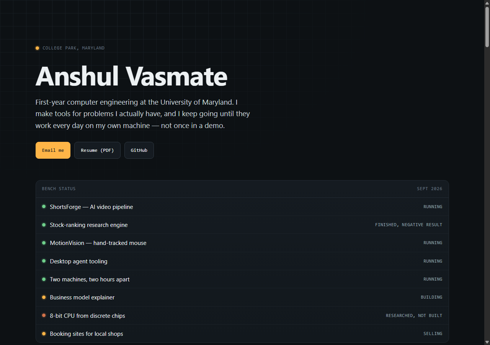

# darkspaz-v1.github.io

Personal portfolio site — a single self-contained `index.html`, served by GitHub Pages at
**[darkspaz-v1.github.io](https://darkspaz-v1.github.io/)**.



## Design

A workbench/instrument direction: graphite background, amber and copper accents, Space Grotesk over
IBM Plex Sans and Mono. The signature element is a **status board** in the hero, listing each project
with an LED and an honest state — Running, Finished with a negative result, Building, Researched but
not built.

Stating that a project produced a negative result is deliberate. A portfolio where everything
"succeeded" tells a reader nothing about judgement.

## Imagery

Labelled so nothing is mistaken for something it is not:

- **Real:** frames from the video pipeline, screenshots of the booking-site demo (captioned as a demo,
  not a client).
- **Drawn as SVG diagrams:** gesture pipeline, MCP safety gates, CPU datapath, business model.
- **The one chart plots real measured numbers** — validation vs holdout IC from an actual results file.

## Local preview

```
python -m http.server 5178
```

No build step. Everything except the images and the resume PDF is in `index.html`.

## License

MIT — see [LICENSE](LICENSE).
